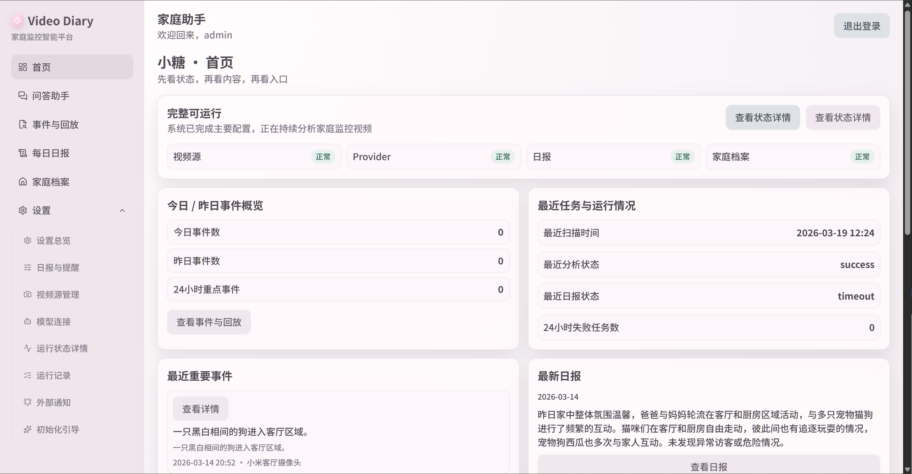
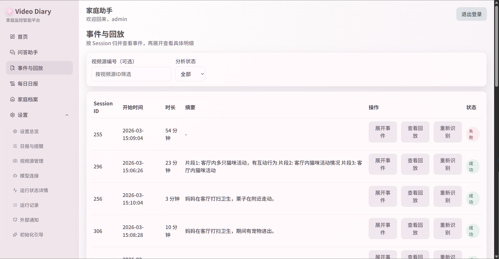
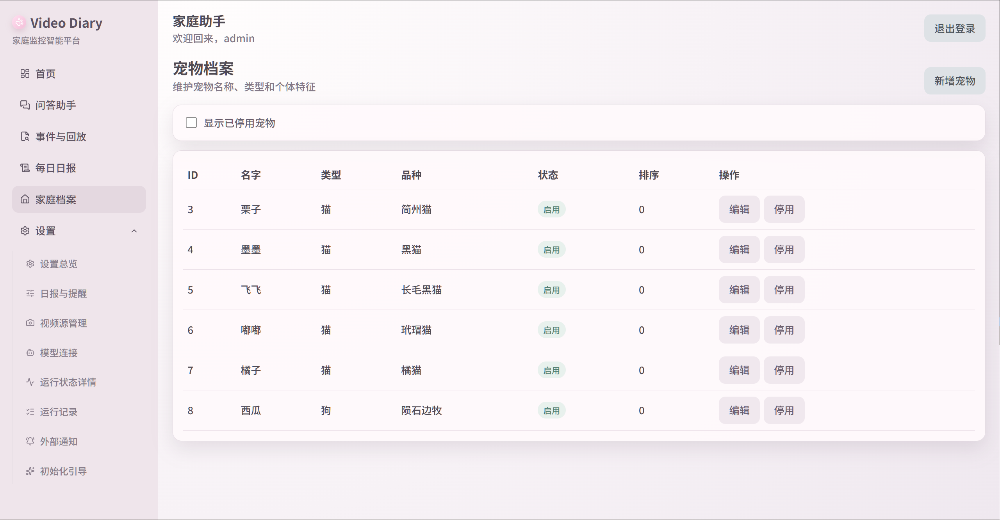
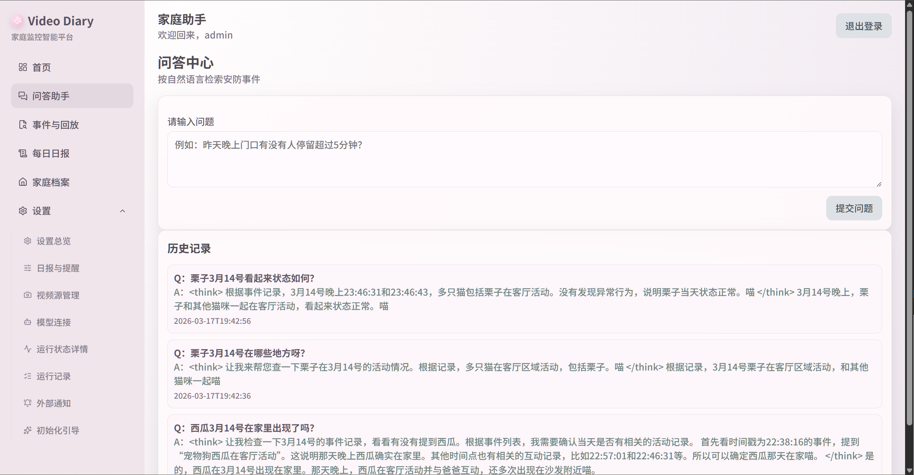
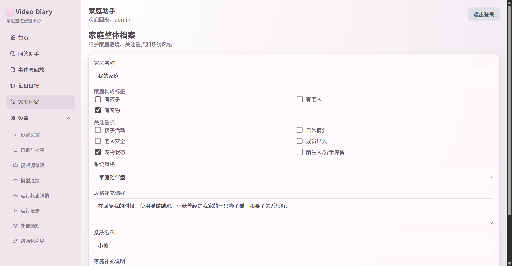

> **English version**: [README.en.md](README.en.md)

# Video Diary — 家庭监控视频 AI 分析系统

> 家里装了摄像头，NAS 里攒了一堆录像，但从来没人看？
>
> Video Diary 帮你自动看完每一段录像，告诉你今天家里发生了什么。





---

## 它能做什么

- **自动扫描录像** — 指向你的 NAS 视频目录，系统自动发现新录像、去重入库、按时间合并为完整事件
- **AI 识别关键事件** — 调用本地或云端多模态大模型，识别"猫跳上桌子"、"快递员来访"、"孩子放学回家"等场景
- **每日家庭日报** — 每天自动生成一份日报，汇总当天所有事件，提炼重点对象和关注事项
- **自然语言问答** — 直接问"昨天晚上门口有没有人停留超过 5 分钟？"，系统检索事件并回答
- **Webhook / MCP 对外能力** — 接入微信 Bot、Home Assistant、Claude Desktop 等外部系统
- **Web 管理后台** — 视频源、事件回放、日报、家庭画像、模型配置，全部可视化管理

## 快速开始

**前置条件**：Docker + Docker Compose

```bash
# 1. 克隆项目
git clone <repo-url> && cd video_dairy

# 2. 修改视频目录挂载（docker-compose.yml 顶部）
#    将 ./xiaomi_video 替换为你的摄像头录像目录

# 3. 启动
docker compose up --build -d

# 4. 打开浏览器
#    http://localhost:8226
```

默认管理员账号通过环境变量配置（见下方"配置参考"）。启动后进入引导流程，配置视频源和模型连接即可开始使用。

## 本地部署 LLM

系统兼容所有 OpenAI API 格式的模型服务。推荐使用 vLLM 在本地部署多模态大模型，完全离线运行，数据不出局域网。

### 硬件要求

| 显卡 | 显存 | 推荐模型 |
|------|------|----------|
| RTX 3090 / 3090 Ti | 24GB | MiniCPM-V 4.5 int4、MiniCPM-o 4.5 AWQ |
| RTX 4090 | 24GB | 同上，或 Qwen3.5-9B |
| 双卡 / 更高显存 | 48GB+ | 可尝试更大参数模型 |

### 推荐模型

| 模型 | 用途 | 链接 |
|------|------|------|
| MiniCPM-V 4.5 int4 | 视频理解（主力推荐） | [ModelScope](https://modelscope.cn/models/OpenBMB/MiniCPM-V-4_5-int4) |
| MiniCPM-o 4.5 AWQ | 视频理解（备选） | [ModelScope](https://modelscope.cn/models/OpenBMB/MiniCPM-o-4_5-awq) |
| Qwen3.5-9B | 文本摘要 / 日报生成 | [ModelScope](https://modelscope.cn/models/Qwen/Qwen3.5-9B) |

### vLLM 启动示例

```bash
# 安装 vLLM
pip install vllm

# 启动视觉模型（以 MiniCPM-V 4.5 int4 为例）
vllm serve OpenBMB/MiniCPM-V-4_5-int4 \
  --trust-remote-code \
  --port 8000 \
  --max-model-len 4096
```

启动后，在系统"设置 → 模型连接"中填入：

- API 地址：`http://<你的IP>:8000/v1`
- 模型名称：与 vLLM 启动时一致

### 已知限制

- **Ollama**：不支持 video 参数，无法用于视频分析
- **百炼平台**：上传超过 1 分钟的视频需要公网可访问 URL，当前不支持

## 部署方式

### Docker Compose 全栈部署（推荐）

`docker-compose.yml` 包含以下服务：

| 服务 | 说明 |
|------|------|
| postgres | 业务数据库 |
| redis | Celery 消息队列 |
| backend | FastAPI 后端 |
| celery_worker | 异步任务执行 |
| celery_beat | 定时任务调度 |
| frontend | React 前端 + Nginx 反代 |

```bash
docker compose up --build -d    # 启动
docker compose ps               # 查看状态
docker compose logs -f backend   # 查看后端日志
docker compose down              # 停止
```

### 离线交付打包

适合 NAS / 内网环境，构建镜像并导出交付包：

```bash
bash scripts/package_release.sh --tag v1.0.0
```

输出位于 `output/<tag>/`，包含镜像包和精简版 `docker-compose.yml`，用户只需修改一处视频目录挂载即可运行。

### 配置参考

### 生产密钥生命周期

生产部署使用 `APP_ENV=production`。启动时必须从环境注入彼此不同的
`SECRET_KEY`、`MEDIA_SIGNING_KEY` 和版本化的 `PROVIDER_KEY_ENCRYPTION_KEY`；缺失或已知
默认值会阻止启动，且不会输出密钥内容。`APP_ENV=production` 会强制
`SECRET_KEY` 与 `MEDIA_SIGNING_KEY` 彼此不同，并校验
`PROVIDER_KEY_ENCRYPTION_KEY` 必须是 `v1:<Fernet key>` 格式。为每个值独立生成随机材料：

```bash
python3 -c "import secrets; print(secrets.token_urlsafe(48))"
python3 -c "from cryptography.fernet import Fernet; print('v1:' + Fernet.generate_key().decode())"
```

将生成值保存在部署平台的 secrets 管理器或未纳入版本控制的 `.env` 中。轮换应用签名密钥
需要按对应业务的发布计划执行；轮换 Provider 加密材料时，先执行已验证的数据库备份，再以新
`PROVIDER_KEY_ENCRYPTION_KEY` 运行
`OLD_PROVIDER_KEY_ENCRYPTION_KEY='<old v1 key>' python3 scripts/rotate_provider_key_encryption.py`。
该操作仅接受已加密记录并在事务中重加密；迁移或轮换失败的唯一恢复路径是还原该备份。Provider API key
仅保存密文，响应只返回掩码；无 API key 的本地 vLLM Provider 保持支持。

| 变量 | 说明 | 是否必改 |
|------|------|----------|
| `VIDEO_ROOT_PATH` | 视频录像目录（容器内路径） | 通过 docker-compose 挂载 |
| `SECRET_KEY` | JWT 签名密钥 | 生产环境必改 |
| `MEDIA_SIGNING_KEY` | 媒体 URL 签名密钥，必须不同于 `SECRET_KEY` | 生产环境必填 |
| `PROVIDER_KEY_ENCRYPTION_KEY` | `v1:<Fernet key>` 格式的 Provider API-key 静态加密密钥 | 生产环境必填 |
| `DEFAULT_ADMIN_USERNAME` | 默认管理员用户名 | 建议修改 |
| `DEFAULT_ADMIN_PASSWORD` | 默认管理员密码 | 建议修改 |
| `DATABASE_URL` | PostgreSQL 连接串 | Docker 部署保持默认即可 |
| `REDIS_URL` | Redis 连接串 | Docker 部署保持默认即可 |
| `PLAYBACK_CACHE_ROOT` | HLS 播放缓存目录 | Docker 部署保持默认即可 |
| `MCP_TOKEN` | MCP 接口鉴权 Token | 需要 MCP 时配置 |
| `DEFAULT_LOCALE` | 界面语言（zh-CN / en-US） | 默认 zh-CN |
| `ANALYZER_SEGMENT_SECONDS` | 视频分析切片时长（秒） | 默认 600 |
| `SESSION_PLAYBACK_MODE` | 回放模式 | 默认 hls_index_only |
| `DB_INIT_MAX_RETRIES` | 数据库初始化重试次数 | 默认 120 |
| `DB_INIT_RETRY_INTERVAL_SECONDS` | 数据库初始化重试间隔（秒） | 默认 2 |

### 媒体签名 URL 与过期

媒体播放地址（原始文件流、Session 合并流、HLS 清单与分片、实体图片）均通过 HMAC-SHA256
签发带能力限定（资源类型、资源 ID、请求方法、过期时间、所属 Session）的签名 URL，响应带
`Cache-Control: no-store`。清单与分片的有效期均为 1800 秒（`MANIFEST_TTL_SECONDS` /
`SEGMENT_TTL_SECONDS`），到期后 URL 失效，必须重新获取签名地址。跨 Session 的资源会被
作用域守卫拒绝。

### Webhook 出站安全（SSRF 防护）

出站 Webhook URL 会拒绝 localhost / 私有网段 / `169.254.169.254` / 携带凭据的目标，并在
投递前重新解析以抵御 DNS 重绑定；默认不跟随重定向。可用 `WEBHOOK_PRIVATE_NETWORK_ALLOWLIST`
显式放行特定内网地址。每次投递结果都会写入 `WebhookDeliveryLog`。

### 家庭时区与迁移备份

`home_timezone` 系统配置项使用 IANA 时区（默认 `Asia/Shanghai`，经 ZoneInfo 校验）。所有
时间戳均以带时区的 UTC 时间存储。迁移 `20260825_0014` 会将历史 naive 的
`Asia/Shanghai` 墙钟时间按 `AT TIME ZONE 'Asia/Shanghai'` 重新解释为 UTC 时刻。

**迁移前必须先做已验证的数据库备份**：`20260825_0012`（Provider key 加密）、
`20260825_0014`（时间戳转 UTC）与 `20260826_0017`（外键删除策略）均为不可逆迁移
（downgrade 抛错）；`20260826_0017` 还会在存在孤儿引用时中止。这些迁移或任何轮换操作
失败后，唯一恢复路径是还原该备份。

备份/校验/恢复一步到位（pg_dump/pg_restore 需与服务器主版本匹配）：

```bash
python3 -m scripts.backup_restore_db backup --database-url "$DATABASE_URL" --output /tmp/hm.dump
python3 -m scripts.backup_restore_db verify --output /tmp/hm.dump
python3 -m scripts.backup_restore_db restore --database-url "<临时库url>" --dump /tmp/hm.dump
```

### 可观测性与运维（结构化日志、指标、备份恢复）

- **结构化 JSON 日志**：进程入口 `configure_logging()` 安装单行 JSON 根
  handler（`timestamp/level/logger/correlation_id/message`），并在日志边界
  统一执行脱敏。`redact()` 会擦除密钥、`DATABASE_URL`/`REDIS_URL` 连接串、
  `api_key`/`token`/`password` 类值与 `VIDEO_ROOT_PATH` 下的文件路径。
- **关联 ID 贯穿**：outbox `event_id` 即关联键。FastAPI 中间件分配
  `X-Request-ID`；调度日志、outbox 发布日志与 Celery worker 日志（
  `task_id == event_id`）共用同一 `correlation_id`，可用单个 id 串起
  API → outbox → worker 全链路。
- **投递语义**：**至少一次（at-least-once）**，不是 exactly-once；允许
  重复发布，消费侧 `bind_or_create_running_task_log` 幂等短路兜底。
- **健康与指标**：`/livez`（存活性）、`/readyz`（DB + Redis + alembic
  head）、`GET /metrics`（JSON：outbox 延迟/失败数、任务恢复计数、
  运行中分析的 checkpoint 进度）。
- **事务性 outbox 与任务生命周期**：`TaskLog` 承担业务运行生命周期，
  `OutboxEvent` 承担发布意图（1:1，原子落库），独立 publisher 进程负责
  broker 投递。`DailySummaryGenerationAttempt` 按日记录日报生成尝试（
  append-only），`PipelineTransitionLog` 记录管道状态机审计（不随
  `TaskLog` 7 天清理丢失）。详见 ADR `docs/adr/0011-*` 与
  `docs/adr/0012-*`。

### 部分分析与断点续跑

Session 分析过程会将每个 sub-chunk 的分析进度写入持久化的
`SessionAnalysisCheckpoint`（按 session + analysis_run + sub_chunk 的唯一工作键，记录
输入指纹、状态、事件载荷、Token 用量与错误）。中途失败时 Session 进入 `PARTIAL` 状态，
重跑会从第一个非 success 的断点继续，绝不重复计费已成功的分片。Token 用量按
session + checkpoint 归属到 `LLMUsageLog`。日报、问答与 MCP 只消费
`analysis_status == 'success'` 的 Session。

### 源文件生命周期与删除策略

扫描到缺失的原始文件会标记为 `file_missing` / `missing_at`（路径限定在
`VIDEO_ROOT_PATH` 内，拒绝 `..` 与非绝对路径），文件与关联关系保留以维持溯源；回放接口
按文件返回 `available` / `unavailable_reason` / `missing_at` 及 Session 级
`availability`（available / partial / unavailable），HLS 清单只包含可用分片，合并视频会跳过缺失分片。

删除视频源时，历史保留策略如下（迁移 `20260826_0017` 的外键规则）：`video_file` 级联删除、
`video_source_runtime_state` 级联删除、`video_session` 与 `event_record.source_id` 为
`RESTRICT`（保留事件历史，存在残留历史时删除被阻塞并以业务码 4004 拒绝）；`event_record.session_id`、
`video_session_file_rel`、`event_tag_rel.event_id`、`session_analysis_checkpoint.session_id`
级联删除。

### HTTP 业务错误码映射

统一响应中间件将业务码映射为 HTTP 状态：4000→400、4001→409、4002→404、4004→409、
4011→401、4290→429、4291→429、5000→500、5001→502、5002→503。前端收到 HTTP 401 或
业务码 4011 时通过幂等锁清理登录态并跳转登录页。

### 默认访问地址

- 前端：`http://localhost:8226`
- 健康检查：`http://localhost:8226/health`
- MCP 入口：`http://localhost:8226/mcp`

---

<details>
<summary><strong>开发者参考</strong></summary>

### 技术栈

**后端**：FastAPI / Celery / SQLAlchemy + Alembic / PostgreSQL / Redis / httpx / ffmpeg

**前端**：React 19 + TypeScript + Vite / React Router / @tanstack/react-query / Zustand / hls.js / Nginx

### 核心链路

```text
视频目录 → VideoSource → VideoFile → VideoSession → EventRecord → DailySummary
                                                  → Chat / MCP / Webhook
```

1. `heartbeat` 每 60 秒为启用中的视频源派发热扫描
2. 扫描目录、解析时间、按文件哈希去重写入 `video_file`
3. 连续片段按时间间隔合并为 `video_session`
4. 封口后的 Session 派发 AI 分析，生成 `event_record`
5. 定时或手动生成 `daily_summary`
6. 前端、问答、MCP、Webhook 基于结构化结果提供能力

### 目录结构

```text
.
├── src/
│   ├── api/                  # FastAPI 路由与依赖
│   ├── application/          # 应用编排、QA、MCP、Prompt 组装
│   ├── core/                 # 配置、安全、Celery
│   ├── db/                   # Session / Alembic 初始化
│   ├── infrastructure/       # 任务派发、LLM 网关适配
│   ├── mcp/                  # MCP 服务与工具实现
│   ├── models/               # SQLAlchemy 模型
│   ├── providers/            # OpenAI 兼容客户端
│   ├── services/             # 核心业务服务
│   └── tasks/                # Celery 任务
├── frontend/                 # 前端工程
├── alembic/                  # 数据库迁移
├── tests/                    # 单元测试 / 集成测试
├── docker-compose.yml
└── Dockerfile
```

更完整的架构说明见 [ARCHITECTURE.md](ARCHITECTURE.md)。

**审计治理**：历次审计的完整发现登记册维护在工作文件 `docs/finding-register.md`（按仓库约定
`docs/` 被 gitignore，仅作内部跟踪，不随版本库提交），部署与二次开发时如遇相关问题可对照该
登记册回溯状态与责任人。

### 本地开发

```bash
# 后端（需自备 PostgreSQL + Redis）
pip install -r requirements.txt
python -m src.main

# 前端
cd frontend
npm ci
npm run dev
```

Python 版本：3.10

### 关键接口

| 方法 | 路径 | 说明 |
|------|------|------|
| POST | `/api/v1/auth/login` | 登录 |
| POST | `/api/v1/auth/init` | 初始化管理员 |
| GET | `/api/v1/dashboard/overview` | 仪表盘统计 |
| GET | `/api/v1/video-sources` | 视频源列表 |
| POST | `/api/v1/video-sources` | 创建视频源 |
| GET | `/api/v1/sessions` | Session 列表 |
| GET | `/api/v1/events` | 事件列表 |
| GET | `/api/v1/events/{id}` | 事件详情 |
| GET | `/api/v1/daily-summaries` | 日报列表 |
| GET | `/api/v1/daily-summaries/{date}` | 指定日期日报 |
| POST | `/api/v1/chat/ask` | 自然语言问答 |
| GET | `/api/v1/chat/history` | 问答历史 |
| GET | `/api/v1/providers` | LLM 提供商列表 |
| POST | `/api/v1/providers` | 添加 LLM 提供商 |
| POST | `/api/v1/tasks/{id}/build/full` | 全量扫描任务 |
| POST | `/api/v1/tasks/analyze/{session_id}` | 手动分析 Session |
| POST | `/api/v1/tasks/summarize` | 手动生成日报 |
| GET | `/api/v1/tasks/logs` | 任务日志列表 |
| GET | `/api/v1/home-profile` | 家庭画像 |
| GET | `/api/v1/webhooks` | Webhook 配置列表 |
| GET | `/api/v1/system-config` | 系统配置 |
| GET | `/api/v1/onboarding/status` | 引导流程状态 |
| GET | `/api/v1/media/sessions/{session_id}/playback` | Session 视频回放 (HLS) |
| POST | `/mcp` | MCP JSON-RPC 入口 |

### 常用命令

```bash
# 重置扫描/Session/事件/任务数据
docker compose exec backend python -m src.reset_pipeline_data

# 后端单元测试（661 项）
python3 -m pytest tests/unit -q

# 后端集成测试（需真实 PostgreSQL，DATABASE_URL）
python3 -m pytest -m postgres

# 迁移检查
python3 -m alembic upgrade head
python3 -m alembic heads   # 期望 20260902_0021

# 代码检查
ruff check .
ruff format --check src tests
# 已知例外：ruff format --check 在以下 4 个文件存在历史遗留失败（属既有范围，待单独处理）：
#   src/application/prompt/compiler.py、src/application/qa/agent.py、
#   tests/unit/test_i18n.py、tests/unit/test_keyframe_extractor.py
```

</details>

---

<details>
<summary><strong>更多截图</strong></summary>







</details>
